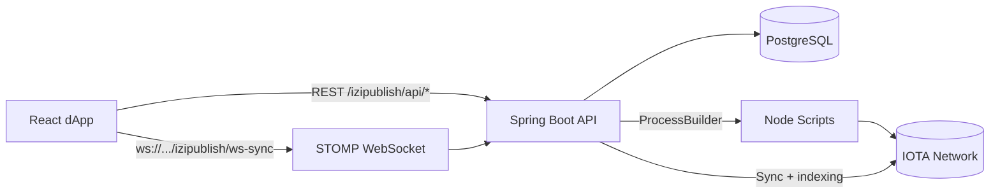
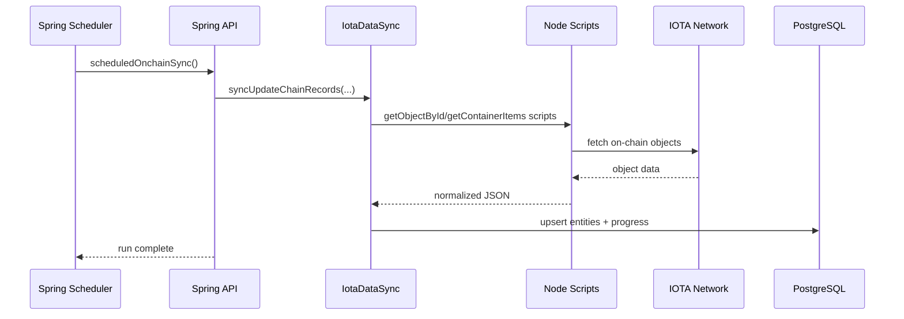

<div align="center">

# EasyPublish Middletier

Spring Boot + PostgreSQL + Node.js integration layer for indexing and serving IOTA on-chain container data.


</div>

---

## System View



## What This Service Does

- Indexes on-chain objects (`container`, `data_type`, `data_item`, `owner`, `owner_audit`, `data_item_verification`, `child`).
- Stores normalized data in PostgreSQL through JPA entities/repositories.
- Exposes REST endpoints for item trees, details, follows, user data, sync status, and report generation.
- Pushes sync status to clients every 5 seconds through STOMP (`/topic/sync-status`).
- Parses `easy_publish` JSON blocks from on-chain content into local publish/report tables.

---

## Workspace Map

```text
.
├── src/main/java/com/easypublish
│   ├── batch/                  # Sync + indexing logic
│   ├── controller/             # REST controllers
│   ├── dtos/                   # API DTO models
│   ├── entities/               # JPA entities (onchain/offchain/parsed)
│   ├── repositories/           # Spring Data repositories
│   ├── service/                # Query/sync/report services
│   └── websocket/sync/         # STOMP configuration + emitter
├── src/main/resources
│   ├── application.properties  # Main runtime config
│   ├── application-test.properties
│   ├── templates/              # HTML + PDF templates
│   └── static/                 # Static assets
├── node/                       # Node scripts for IOTA object fetches
├── react/iota-dapp_backup_20260323_224441/   # Frontend app source
└── pom.xml                     # Maven build
```

---

## Quick Start

### Prerequisites

| Tool | Version Used By Project |
|---|---|
| Java | 25 |
| Maven | 3.9+ |
| Node.js | 24.1.0 |
| PostgreSQL | 14+ recommended |

GitHub Actions CI also uses `Node 24.1.0` and `JDK 25`.

### 1) Install Node script dependencies

```bash
cd node
npm install
cd ..
```

### 2) Configure database

Default local settings in `src/main/resources/application.properties`:

```properties
spring.datasource.url=jdbc:postgresql://localhost:5432/devdb
spring.datasource.username=dev
spring.datasource.password=dev
```

Create the DB/user (example):

```sql
CREATE DATABASE devdb;
CREATE USER dev WITH PASSWORD 'dev';
GRANT ALL PRIVILEGES ON DATABASE devdb TO dev;
```

### 3) Run backend

```bash
mvn spring-boot:run
```

Default base URL:

- `http://localhost:8084/izipublish`

### 4) Run frontend (backup app in this repo)

```bash
cd react/iota-dapp_backup_20260323_224441
npm install
npm run dev
```

---

## Configuration

### Core App

| Key | Purpose | Default |
|---|---|---|
| `server.port` | Backend port | `8084` |
| `server.servlet.context-path` | API root prefix | `/izipublish` |
| `sync.chain.last` | Update-chain object id used by sync status | configured in file |
| `sync.chain.DataItem` | Data-item chain object id used by sync status | configured in file |

### CORS (centralized in properties)

| Key | Example |
|---|---|
| `app.cors.allowed-origins` | `http://localhost:5173,https://izipublish.com,https://cars.izipublish.com` |
| `app.cors.allowed-methods` | `GET,POST,PUT,DELETE,OPTIONS` |
| `app.cors.allowed-headers` | `*` |

Used by:

- HTTP CORS config: `WebConfig`
- WebSocket endpoint origins: `WebSocketConfig`

---

## API Reference

All paths below are relative to `/izipublish`.

### Content and Navigation

| Method | Path | Notes |
|---|---|---|
| `GET` | `/api/items` | Main tree endpoint (`include`, `userAddress`, optional `containerId`, `dataTypeId`, `dataItemId`, `dataItemVerificationId`, `dataItemVerificationVerified`, `dataItemQuery`, `dataItemSearchFields`, `dataItemVerified`, `dataItemHasRevisions`, `dataItemHasVerifications`, `dataItemDataType`, `dataItemSortBy`, `dataItemSortDirection`, `domain`, `page`, `pageSize`) |
| `GET` | `/api/containers/{id}` | Container by ID |
| `GET` | `/api/data-types/{id}` | DataType by ID |
| `GET` | `/api/data-items/{id}` | DataItem by ID |

### Follow System

| Method | Path | Notes |
|---|---|---|
| `POST` | `/api/follow-container` | Follow one or many containers (`userAddress`, `containerIds`) |
| `DELETE` | `/api/follow-container` | Unfollow one (`userAddress`, `containerId`) |
| `DELETE` | `/api/follow-containers` | Unfollow all for a user (`userAddress`) |
| `GET` | `/api/followed-containers` | Paginated followed list (`userAddress`, `page`, `pageSize`) |

### User and Sync

| Method | Path | Notes |
|---|---|---|
| `GET` | `/api/user/{address}` | Load user record |
| `POST` | `/api/user/{address}/update` | Create/update user timestamps |
| `GET` | `/api/sync/{chainObjectId}` | Sync status payload |

### Reports

| Method | Path | Notes |
|---|---|---|
| `POST` | `/api/report/car` | Generates PDF (`dataItemId` or `dataTypeId`) |

### Curl Examples

```bash
curl "http://localhost:8084/izipublish/api/items?include=CONTAINER&userAddress=0x123&page=0&pageSize=20"
```

```bash
curl "http://localhost:8084/izipublish/api/items?include=CONTAINER,DATA_TYPE,DATA_ITEM,DATA_ITEM_VERIFICATION&userAddress=0x123&containerId=0xcontainer&page=0&pageSize=20"
```

```bash
curl "http://localhost:8084/izipublish/api/items?include=CONTAINER,DATA_TYPE,DATA_ITEM,DATA_ITEM_VERIFICATION&userAddress=0x123&containerId=0xcontainer&dataItemVerificationVerified=true&page=0&pageSize=20"
```

```bash
curl "http://localhost:8084/izipublish/api/items?include=CONTAINER,DATA_TYPE,DATA_ITEM,DATA_ITEM_VERIFICATION&userAddress=0x123&containerId=0xcontainer&dataItemQuery=oil%20change&dataItemSearchFields=name,description,externalId,externalIndex&dataItemSortBy=created&dataItemSortDirection=desc&page=0&pageSize=20"
```

### `/api/items` Pagination Levels

- `container` level: when `containerId` is not provided.
- `data_type` level: when `containerId` is set and `include` has `DATA_TYPE` but not `DATA_ITEM`.
- `data_item` level: when `containerId` is set and `include` has `DATA_ITEM`.

Response includes a `meta` object with:

- `paginationLevel`, `page`, `pageSize`, `totalPages`, `hasNext`
- `includes`, `filters`
- aggregate counters (`totalContainers`, `totalDataTypes`, `totalDataItems`, `totalDataItemVerifications`)
- `availableDataTypes` in `data_item` mode (for frontend filter dropdowns)
- `dataItemVerificationFilteredAfterPagination` flag for frontend handling

Frontend handoff guide:

- `docs/frontend-items-integration.md`

```bash
curl -X POST "http://localhost:8084/izipublish/api/report/car?dataTypeId=0x..." \
  -o car-report.pdf
```

---

## WebSocket

- Endpoint: `ws://localhost:8084/izipublish/ws-sync`
- Broker topic: `/topic/sync-status`
- Publish cadence: every 5 seconds (`SyncEmitterService`)

Example STOMP subscription destination:

```text
/topic/sync-status
```

---

## Chain Sync Flow



---

## Build and Profiles

### Standard build

```bash
mvn clean package
```

### Tests

```bash
mvn test
```

### Native profile (GraalVM tooling configured)

```bash
mvn -Pnative package
```

### Native fast profile (faster dev iteration)

```bash
mvn -Pnative-fast package
```

Output binary:

- `target/native-fast.img`

---

## Configuration Keys

The following values were extracted from hardcoded code paths into `application.properties`:

- `app.node.binary`
- `app.node.items-script`
- `app.node.directory`
- `app.iota.network`
- `app.iota.rpc-urls`
- `app.iota.rpc-attempts-per-url`
- `app.iota.rpc-retry-delay-ms`
- `app.iota.node-fetch-max-attempts`
- `app.iota.node-fetch-retry-delay-ms`
- `app.onchain-sync.enabled`
- `app.onchain-sync.initial-delay-ms`
- `app.onchain-sync.fixed-delay-ms`
- `app.onchain-sync.smart-contract-id`
- `app.onchain-sync.container-chain-id`
- `app.onchain-sync.update-chain-id`
- `app.onchain-sync.data-item-chain-id`
- `app.onchain-sync.data-item-verification-chain-id`
- `app.websocket.broker-prefix`
- `app.websocket.app-prefix`
- `app.websocket.endpoint`
- `app.websocket.sync-topic`
- `app.sync.status-push-rate-ms`
- `app.easy-publish.offchain-index-enabled`
- `app.easy-publish.offchain-index-ms`
- `app.easy-publish.offchain-index-initial-delay-ms`
- `app.follow.max-per-user`
- `app.domain.default-public`

---

## Notes and Known Constraints

- No Maven wrapper is currently committed (`mvnw` is missing), so Maven must be installed locally.
- Node scripts read network/RPC config from `app.iota.*` via Java process env propagation.
- Frontend code in this workspace is currently in:
  - `react/iota-dapp_backup_20260323_224441`
- For Docker/production, use Spring Boot jar:
  - `target/easypublish-0.0.1-SNAPSHOT.jar`

---

## Troubleshooting

### Backend starts but no chain data appears

- Confirm Node dependencies are installed in `node/`.
- Confirm Node scripts can run manually:

```bash
cd node
node getObjectById.js 0xYOUR_OBJECT_ID
```

- If logs show `Node process failed ... fetch failed`, configure explicit RPC URLs:

```properties
app.iota.network=testnet
app.iota.rpc-urls=https://api.testnet.iota.cafe
```

- You can also increase retry behavior for unstable network links:

```properties
app.iota.rpc-attempts-per-url=3
app.iota.node-fetch-max-attempts=4
```

### CORS issues in browser

- Verify `app.cors.allowed-origins` includes your frontend origin.
- Restart backend after changing `application.properties`.

### DB connection errors

- Ensure PostgreSQL is running.
- Check credentials in `application.properties`.
- Confirm `devdb` exists.

### `No qualifying bean of type 'jakarta.persistence.EntityManager'`

- This usually means the wrong artifact was launched (for example an assembly/uber jar).
- Run this artifact in Docker:

```bash
java -jar /app/easypublish-0.0.1-SNAPSHOT.jar
```

- If your Docker image copies `target/*.jar`, pin it to the Spring Boot jar filename explicitly.

### `Main entry point class ... neither found on classpath` (native build)

- Native build should run with profile `native` or `native-fast` only.
- Clean stale artifacts first, then rebuild:

```bash
mvn -Pnative-fast clean package
```

---

## License

No license file is currently present in this repository.
